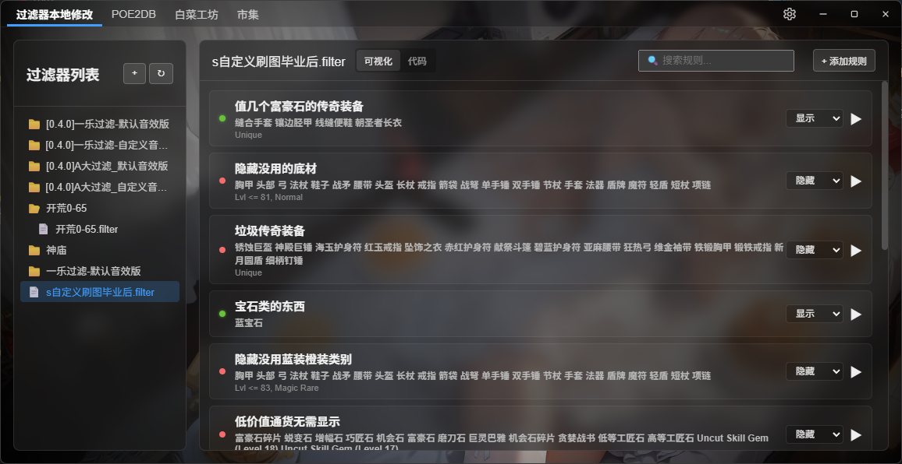

# Warlord Tools (藏身处战神工具箱)
此工具可以轻松实现过滤器本地修改，适合独狼宝宝体制。



QQ交流群 977107224 (BUG反馈和改进建议)

<!-- Badges Section -->
<div align="center">

[](LICENSE)
[](https://github.com/StarBobis/warlordtools/stargazers)
[](https://github.com/StarBobis/warlordtools/network)
[](https://github.com/StarBobis/warlordtools/issues)
[](https://github.com/StarBobis/warlordtools/pulls)
<br/>
[](https://github.com/StarBobis/warlordtools/releases)
[](https://github.com/StarBobis/warlordtools/releases)
[](https://github.com/StarBobis/warlordtools)

</div>


## 功能特性

- **过滤器本地编辑**：无需上传网页，快速修改过滤器规则。
- **常用工具集成**：集成了一些常用工具网页

## 开发

```bash
# 第一次下载后安装依赖
bun install

# 本地开发测试
bun tauri dev

# 构建发布版安装包
bun tauri build
```

# 补充信息

- 制作自定义音效可以试试8bit效果生成器，测了效果还不错：https://sfxr.me/
- 过滤器规则参考：https://www.pathofexile.com/item-filter/about

## Star History

<div align="center">
 <a href="https://star-history.com/#StarBobis/warlordtools&Date">
  <picture>
    <source media="(prefers-color-scheme: dark)" srcset="https://api.star-history.com/svg?repos=StarBobis/warlordtools&type=Date&theme=dark" />
    <source media="(prefers-color-scheme: light)" srcset="https://api.star-history.com/svg?repos=StarBobis/warlordtools&type=Date" />
    
  </picture>
 </a>
</div>